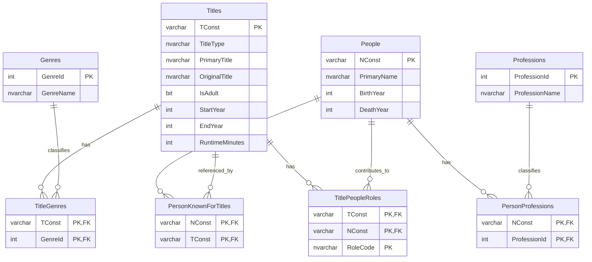

# IMDB mandatory assignment

## Group members

Individual hand-in.

## Database diagram



## DB design description

The solution uses SQL Server and is split into two layers:

1. `staging` tables hold the raw imported TSV data.
2. Normalized `dbo` tables hold the final relational model used by the UI.

This design makes the import fast and simple while still keeping the final searchable database normalized.

## Tables and columns

### Staging tables

- `staging.TitleBasicsImport(TConst, TitleType, PrimaryTitle, OriginalTitle, IsAdult, StartYear, EndYear, RuntimeMinutes, GenresCsv)`
- `staging.NameBasicsImport(NConst, PrimaryName, BirthYear, DeathYear, PrimaryProfessionCsv, KnownForTitlesCsv)`
- `staging.TitleCrewImport(TConst, DirectorsCsv, WritersCsv)`

The staging tables are only temporary import buffers.

### Final normalized tables

- `dbo.Titles(TConst, TitleType, PrimaryTitle, OriginalTitle, IsAdult, StartYear, EndYear, RuntimeMinutes)`
- `dbo.Genres(GenreId, GenreName)`
- `dbo.TitleGenres(TConst, GenreId)`
- `dbo.People(NConst, PrimaryName, BirthYear, DeathYear)`
- `dbo.Professions(ProfessionId, ProfessionName)`
- `dbo.PersonProfessions(NConst, ProfessionId)`
- `dbo.PersonKnownForTitles(NConst, TConst)`
- `dbo.TitlePeopleRoles(TConst, NConst, RoleCode)`

## Non-standard datatypes

No special datatypes were required. Standard SQL Server types were enough:

- `VARCHAR(12)` for IMDb IDs like `tt1234567` and `nm1234567`
- `NVARCHAR` for text because movie and person names can contain international characters
- `BIT` for the adult flag
- `INT` for year and runtime

## Primary keys

- `Titles.TConst`
- `Genres.GenreId`
- `People.NConst`
- `Professions.ProfessionId`
- `TitleGenres(TConst, GenreId)`
- `PersonProfessions(NConst, ProfessionId)`
- `PersonKnownForTitles(NConst, TConst)`
- `TitlePeopleRoles(TConst, NConst, RoleCode)`

## Foreign keys and why they exist

- `TitleGenres.TConst -> Titles.TConst` to connect titles and genres
- `TitleGenres.GenreId -> Genres.GenreId` to avoid storing genre text repeatedly
- `PersonProfessions.NConst -> People.NConst` to connect people and professions
- `PersonProfessions.ProfessionId -> Professions.ProfessionId` to normalize professions
- `PersonKnownForTitles.NConst -> People.NConst` and `PersonKnownForTitles.TConst -> Titles.TConst` to normalize the `knownForTitles` list
- `TitlePeopleRoles.TConst -> Titles.TConst` and `TitlePeopleRoles.NConst -> People.NConst` to normalize directors and writers from `title.crew.tsv`

## Normalization

The design aims for **3rd Normal Form (3NF)**.

Reasoning:

- Each table stores one entity type only.
- Multi-value columns from the source files such as genres, professions, known-for titles, directors and writers are split into junction tables.
- Non-key columns depend only on the key of their own table.

The only intentional deviation from the normalized model is the use of `staging` tables. They are not part of the final application model; they are only used during import to keep the import simple and efficient.

## Indexes

Indexes are used on:

- `Titles.PrimaryTitle` for title search
- `People.PrimaryName` for person search
- Foreign-key columns in the junction tables for join performance

Indexes are not added to every column, because that would increase storage and slow down inserts without helping the required user stories.

## Views

- `dbo.vw_TitleSearch`: exposes only the columns needed for movie search
- `dbo.vw_PersonSearch`: exposes only the columns needed for person search

The UI can search through views instead of direct table access.

## Functions

No SQL functions were required for the mandatory part.

## Stored procedures

- `dbo.usp_RebuildNormalizedDataFromStaging`: converts imported staging rows into the normalized tables
- `dbo.usp_SearchTitles`: wildcard title search, sorted alphabetically
- `dbo.usp_SearchPeople`: wildcard person search, sorted alphabetically
- `dbo.usp_AddTitle`: adds basic title information and generates a new `tconst`
- `dbo.usp_AddPerson`: adds basic person information and generates a new `nconst`
- `dbo.usp_UpdateTitle`: updates basic title information
- `dbo.usp_DeleteTitle`: deletes a title and related junction rows

## Custom roles

- `imdb_ui_executor`: used by the UI connection user

Purpose:

- The role gets `SELECT` on search views and `EXECUTE` on the stored procedures needed by the UI.
- The role is explicitly denied direct access to tables, including staging tables.

## Import method

The project uses a **database-first** approach.

Import steps:

1. Run `sql/01_schema.sql`
2. Run `sql/02_security.sql`
3. Use the console application to bulk copy the three mandatory files into staging tables
4. Call `dbo.usp_RebuildNormalizedDataFromStaging`

The import code uses `SqlBulkCopy` for performance and `STRING_SPLIT` in SQL Server to normalize comma-separated source columns.

## All DDL / schema

All database DDL is included in:

- `sql/01_schema.sql`
- `sql/02_security.sql`

## SQL injection safety

The UI is SQL injection safe because:

- all UI database calls use parameterized stored procedure calls from C#
- the search input is passed as a parameter, never concatenated into SQL strings
- import uses `SqlBulkCopy`, not string-built SQL

## UI

The UI is a simple console application with the following mandatory features:

- initialize database objects
- import mandatory IMDb files
- search movie titles using wildcard searching
- search people using wildcard searching
- add a movie with basic title information
- add a person with basic name information
- update movie basic information
- delete movie basic information

## How to run

Environment variables:

- `IMDB_ADMIN_CONNECTION` should point to SQL Server and can use `Database=master` for initialization
- `IMDB_APP_CONNECTION` should point to the `IMDB` database and use a login/user mapped to role `imdb_ui_executor`
- `IMDB_DATA_DIRECTORY` should point to the folder containing:
  - `title.basics.tsv`
  - `name.basics.tsv`
  - `title.crew.tsv`

Then run:

```powershell
dotnet run
```
